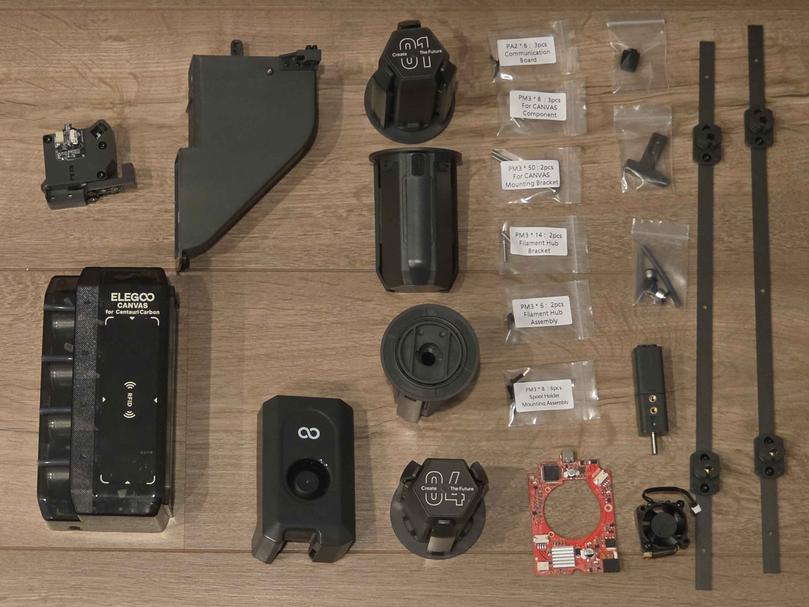
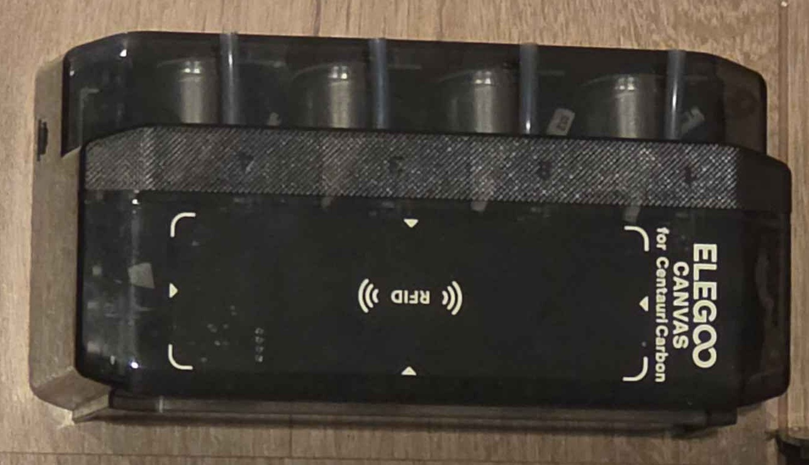
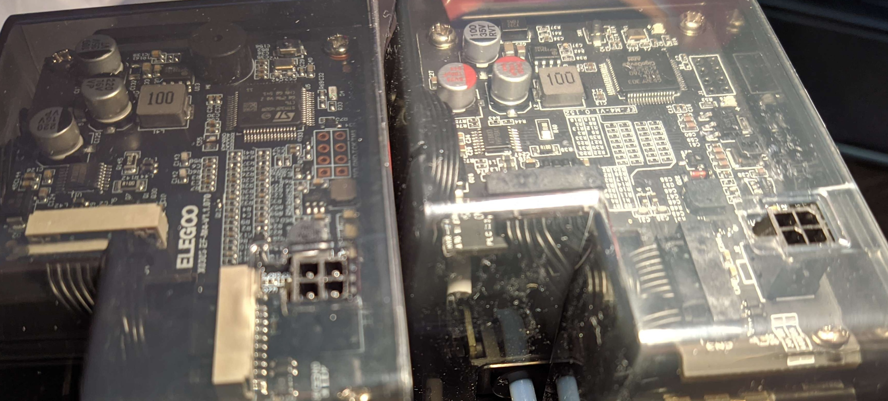
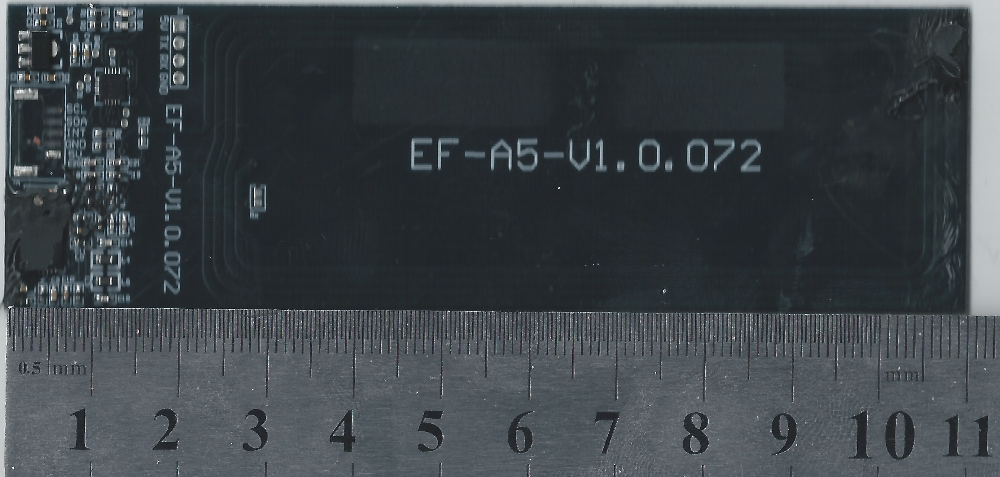
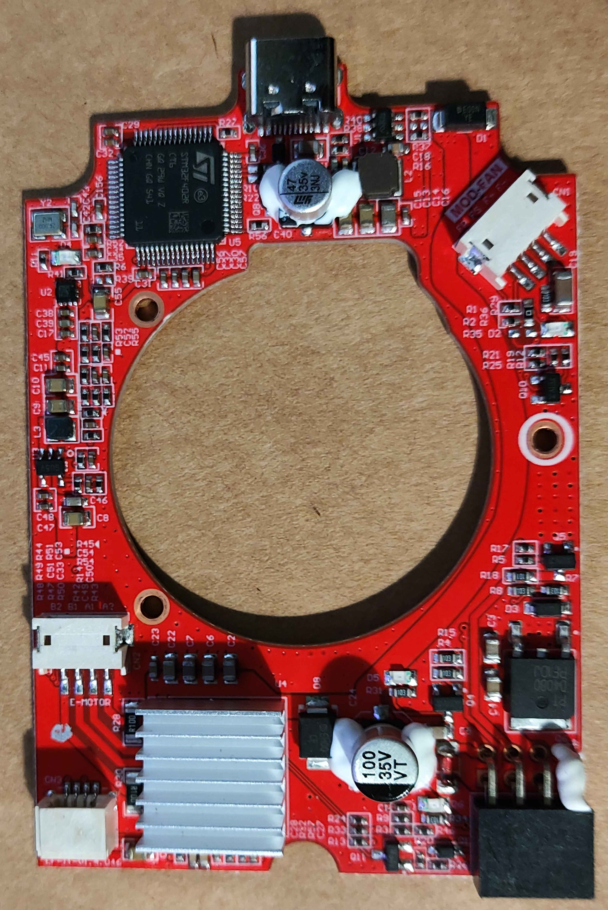
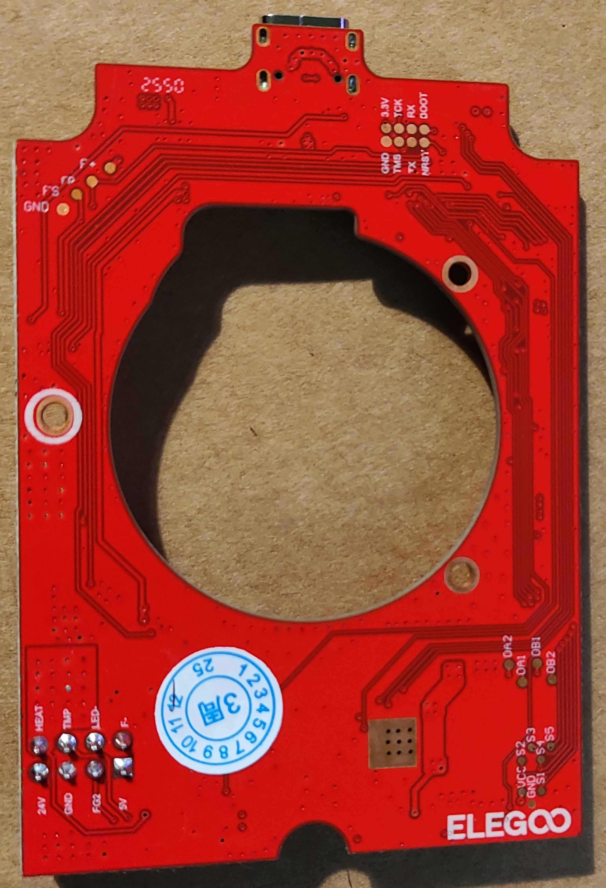
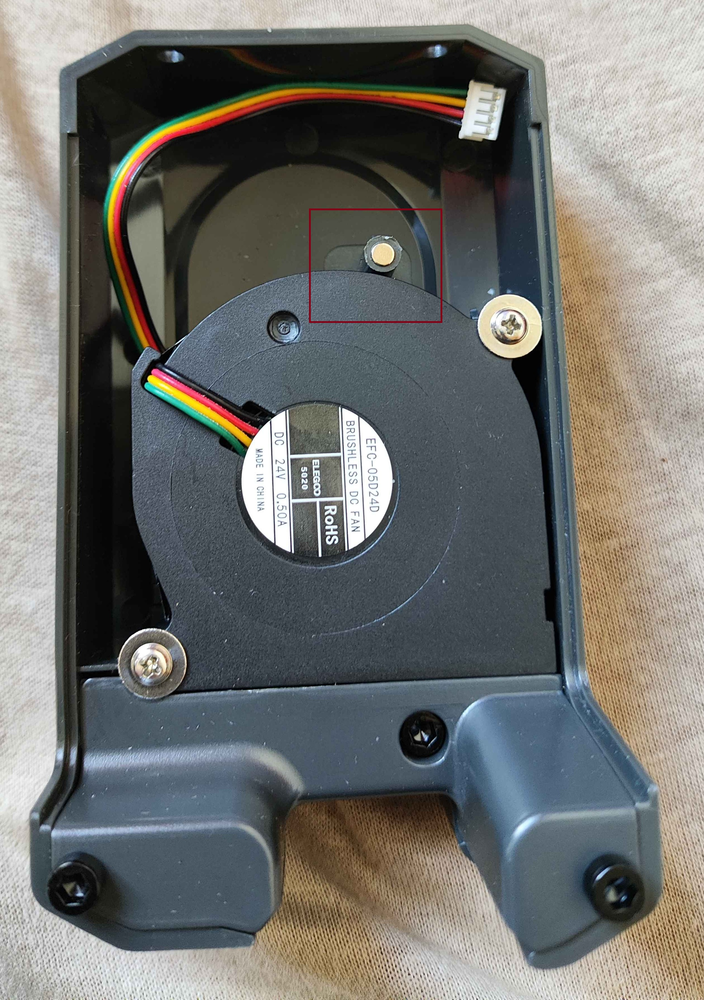

# CC2 CANVAS

## Overview

CANVAS is a multimaterial/multicolor upgrade kit for the Centauri Carbon 1 that is mechanically similar to the CC2C canvas system. It employs a Type B design based on [Happy-Hare nomenclature](https://github.com/moggieuk/Happy-Hare/wiki/Conceptual-MMU) with a filament multiplexer proximal to the toolhead for minimal retraction distance. The official manual is available [here](https://raw.githubusercontent.com/OpenCentauri/tools/refs/heads/main/pdf/CC1_canvas_manual_EN.pdf). Further details about its mechanical operation are available in the [CC2 CANVAS documentation](../CC2/CANVAS.md) as this page will mainly document unique features of the CC1 CANVAS.

{ width="800" }
/// caption
The contents of a CC1 CANVAS upgrade kit excluding cables, a top cover is not included with the upgrade package.
///

## CANVAS Module

{ width="800" }

The CANVAS core module mounts on the top frame insert of the CC2 alongside the tophat. It is mechanically identical to the CC2 CANVAS but it uses alternate boards though with the same MCU.

### CANVAS Mainboard

Metric|Value
---|---
MCU|GD32F303RCT6
Vendor Id|
Product Id|
Device BCD|
Product|
Manufacturer|GigaDevice Semicon Beijing
Stepper driver|4xAT8833 (DRV8833 clone)

{ width="800" }
/// caption
Comparison of CANVAS mainboards. Left: CC1 upgrade Right: CC2 combo
///

### RFID Board
An RFID reader board is present in the front of the shell to read filament information, It is a slightly different revision from that on the CC2 combo.

{ width="800" }
/// caption
CANVAS RFID Board.
///

## Spool Holders

CC2 spool holders are reused though two adapter brackets are supplied to compensate for the lack of additional tapped holes on the CC1 frame (see image of full kit contents)

## Filament Multiplexer

An identical filament multiplexer is supplied with the CC1 upgrade as is provided in the CC2 combo.

## Revised Toolhead Board

In order to support the Filament cutter actuator hall effect sensor and front cover removal hall effect sensor as well as the filament detector a new toolhead PCB is supplied that is distinct from both the original CC1 toolhead board, and the CC2 board. Notably it includes an additional port for the filament detector but retains the populated LED MOSFET for toolhead lighting, unlike the CC2. A new breakout board is not supplied so the original CC1 breakout board for the thermistor, heater, and hotend fan is reused.

Front|Back
---|---
{ width="800" }|{ width="800" }

### Toolhead Board MCU

Metric|Value
---|---
MCU|STM32F402RCT6
USB Spec|v1.0 (full-speed)
Vendor Id|1d50
Product Id|614e
Device BCD|2.00
Product|STM32 Virtual ComPort
Manufacturer|ShenZhenCBD
Stepper driver|TMC2209

## Extruder Upgrade with Filament Detector

A Centauri Carbon 2 extruder with filament detector board is provided in the upgrade kit to support AMS reliability.

## Revised front cover and Hotend Fan assembly

As the CC2 extruder PCB supports a hall effect sensor attached to the hotend fan duct a new duct and fan are provided with this sensor. It is identical to the corresponding CC2 part and is used to detect filament cutter actuation.

Additionally as the filament detector board also faces a forward-facing hall effect sensor to detect removal of the toolhead cover a new cover and fan is provided with a magnet for this purpose. However the fan is a standard CC1 5020 fan and not the integrated custom fan used on the CC2

{ width="800" }
/// caption
The revised toolhead cover with new magnet annotated with a red box.
///

