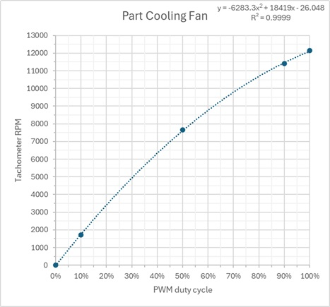

# CC1 Toolhead

Front|Back
---|---
{ width="800" }|{ width="800" }
Credit to thijskunst on the OpenCentauri Discord.|Credit to thijskunst on the OpenCentauri Discord.

The toolhead board is connected over a USB-C cable. This USB-C interface carries 24v. Communication is done via a serial-over-usb interface. The MCU provides a virtual com port when booted. The toolhead board runs Klipper MCU firmware, specifically [v0.9.1-616-g28f60f7e-dirty-20220408_035823-fluiddpi](https://github.com/Klipper3d/klipper/commit/28f60f7ef69847f1514371d1c6788c3c0df98533)

!!! example
    The board boots from a simple 5v USB connection.

!!! warning
    You can make the toolhead board boot into DFU mode by bridging the boot and 3.3v pins on the back during power-on. The board is in Read Out Protection mode.

## Supplementary board

{ width="600" }
/// caption
Credit to rabirx on the OpenCentauri Discord.
///

The Toolhead board has an 2x4 pin port at the bottom of the board. This connector connects to a separate pcb, that breaks out the necessary connectors for the hotend (Temperature sensor, heater, hotend fan).

## MCU

Metric|Value
---|---
MCU|STM32F402RCT6
USB Spec|v1.0 (full-speed)
Vendor Id|1d50
Product Id|614e
Device BCD|2.00
Product|STM32 Virtual ComPort
Manufacturer|ShenZhenCBD
Stepper driver|TMC2209

## Hardware

Metric|Value
---|---
Motor type|10T NEMA14 (round, 20.5mm long)
Motor P/N|BJY36D12-04V28
Motor MFG|SHENZHEN  KELI MOTOR  LTD
Extruder gear ratio|52:10
Extruder hobbed gear diameter|10mm nominal
Extruder hobbed gear material|SDK11 tool steel
Heater type|Ceramic plate-type PTC heater
Heater resistance|~9.6Ω
Heater power|60W
Thermistor Type| Glass bead NTC-100k
Thermistor Beta| 4300
Fan manufacturer| Shenzhen Hua Xinrong Plastic Electronics Co., Ltd
Part cooling fan type|5020 Wide mouth radial fan, 4 pin (tach+5V PWM)
Part cooling fan P/N|EFC-05D24D
Part cooling fan power|0.50A @ 24V
Part cooling fan speed|12,000 RPM
Hotend fan type|3010 axial fan, 3 pin (tach)
Hotend fan P/N|BFC-03A24L
Hotend fan power|0.10A @ 24V
Hotend fan speed|12,000 RPM

The Part cooling and hotend fans use variable frequency tachometer outputs with a set 50% duty cycle. Fan speed is 60/2*[Tach Hz].

{ width="400" }
/// caption
Plot of part cooling fan speed as measured by oscilloscope vs input PWM duty cycle.
Credit to baconmilkshake on the OpenCentauri Discord.
///
