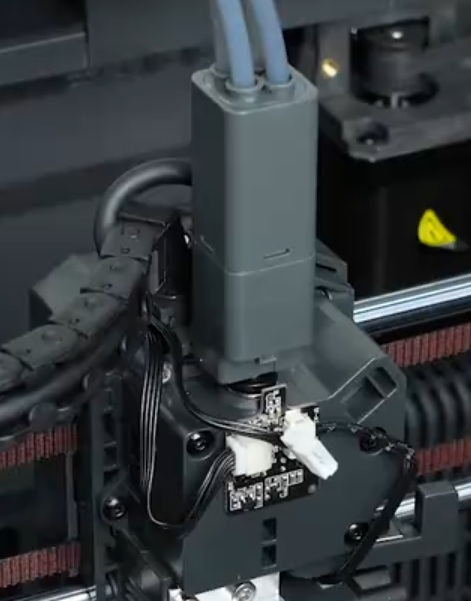
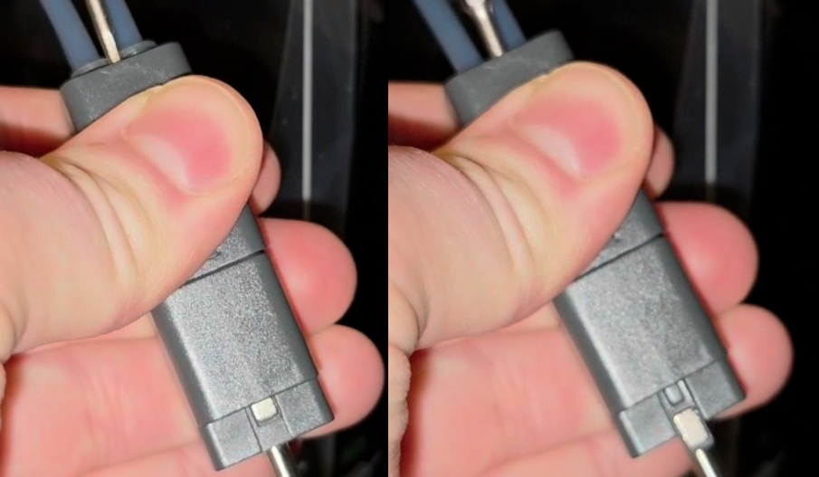
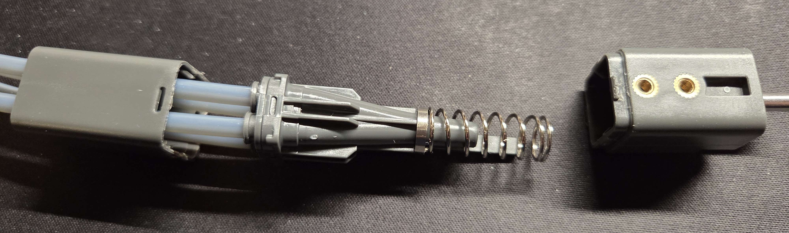
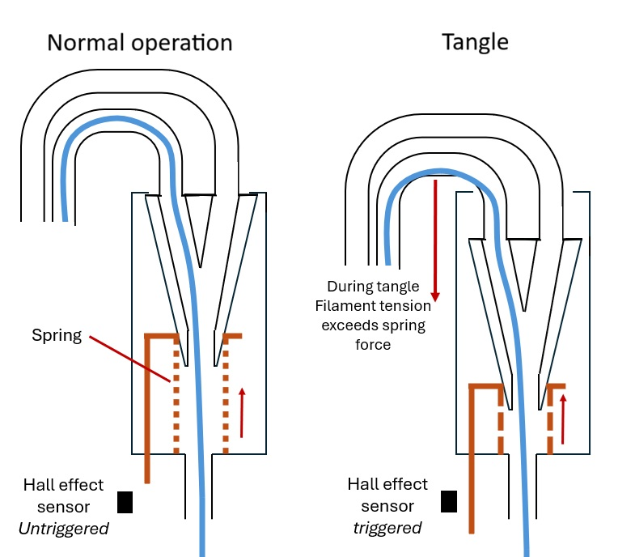

## Overview

CANVAS is a multimaterial/multicolor module for the Centauri Carbon 2. It employs a Type B design based on [Happy-Hare nomenclature](https://github.com/moggieuk/Happy-Hare/wiki/Conceptual-MMU) with a filament multiplexer proximal to the toolhead for minimal retraction distance.

## CANVAS Module

{ width="800" }
/// caption
Credit to keefe826 on the OpenCentauri Discord.
///

The CANVAS core module mounts on the top frame insert of the CC2 alongside the tophat. The system superficially resembles the Flashforge IFS system but is internally distinct and uses independent hobbed gears and motors rather than a cam-based selector. Four permanent magnet stepper motors are used to control filament channels, likely combined with worm gearing. The motors are produced by Shenzhen Wanzhida Motor Manufacturing Co., Ltd.

{ width="800" }

{ width="800" }
/// caption
CANVAS internals. Credit to u/CalligrapherLoud778 on the Elegoo subreddit.
///
{ width="800" }
/// caption
CANVAS motors. Credit to u/CalligrapherLoud778 on the Elegoo subreddit.
///

###CANVAS Mainboard

Metric|Value
---|---
MCU|GD32F303RCT6
Vendor Id|
Product Id|
Device BCD|
Product|
Manufacturer|GigaDevice Semicon Beijing
Stepper driver|4xAT8833 (DRV8833 clone)

{ width="800" }
/// caption
CANVAS Mainboard. Credit to u/CalligrapherLoud778 on the Elegoo subreddit.
///

### RFID Board
An RFID reader board is present in the front of the shell to read filament information, it connects to the rear of the mainboard over I2C.

{ width="800" }
/// caption
CANVAS RFID Board. Credit to u/CalligrapherLoud778 on the Elegoo subreddit.
///
{ width="400" }
/// caption
RFID board seen connected to the rear of the CANVAS mainboard. Credit to u/CalligrapherLoud778 on the Elegoo subreddit.
///

### Filament Detector Boards
Filament detector boards are sent along the filament path for each channel and appear to use Hall effect sensors similarly to the IFS

## Spool Holders

Canvas spool holders are secured to the frame by means of two holes tapped into the vertical extrusions. They are mechanically similar to Flashforge IFS spool holders and have an internal spring to rewind filament to prevent tangling during filament unloading.

## Filament Multiplexer

The filament multiplexer is mounted directly to the extruder housing with a 4mm OD metal tube at the bottom of the multiplexer replacing the PTFE reverse Bowden tubing. This positioning enables shorter swap times due to reduce retraction distance during load/unload cycles.

{ width="400" }
/// caption
The Filament multiplexer mounted, with the filament detector PCB tab and tangle detection sensor in front of it.
///

The CC2 detects tangles by means of a rear facing Hall effect sensor at the top of the [Filament Detector PCB](../toolhead/#filament-detector-board). When filament is tangled a small metal tab extends from the filament multiplexer, activating the tangle sensor.

{ width="600" }
/// caption
The multiplexer tangle detection tab shown in non-triggered (left), and triggered (right) positions. Credit to laser_velociraptor on the Elegoo Discord.
///

The multiplexer uses a spring loaded mechanism to maintain the pneumatic fitting hub against the top surface of the multiplexer housing. When a tangle occurs the extruder continues increasing filament tension until it exceeds the force applied by the spring. The spring is compressed thus pushing the metal tab in front of the Hall effect sensor, triggering a tangle error and pausing the print.

{ width="600" }
/// caption
Multiplexer internals. Credit to laser_velociraptor on the Elegoo Discord.
///

{ width="600" }
/// caption
A schematic diagram showing the filament hub operation in non-triggered (left), and triggered (right) positions. Credit to baconmilkshake on the OpenCentauri Discord.
///
