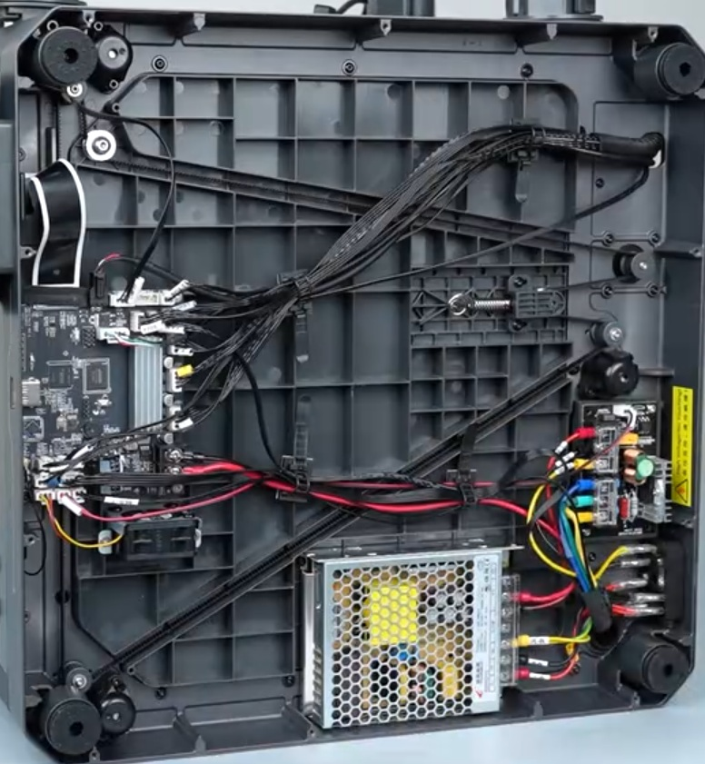

-   Centauri Carbon 2 Printer specifications:
    
    Metric|Value
    ---|---
    Print area size|256 mm^3
    Hotend|350 °C All-Metal
    Heatbed|110 °C AC-powered
    Max power usage|1100W@220V, 350W@110V
    Weight|17.65kg
    Machine size|398x404x490mm

{ width="800" }