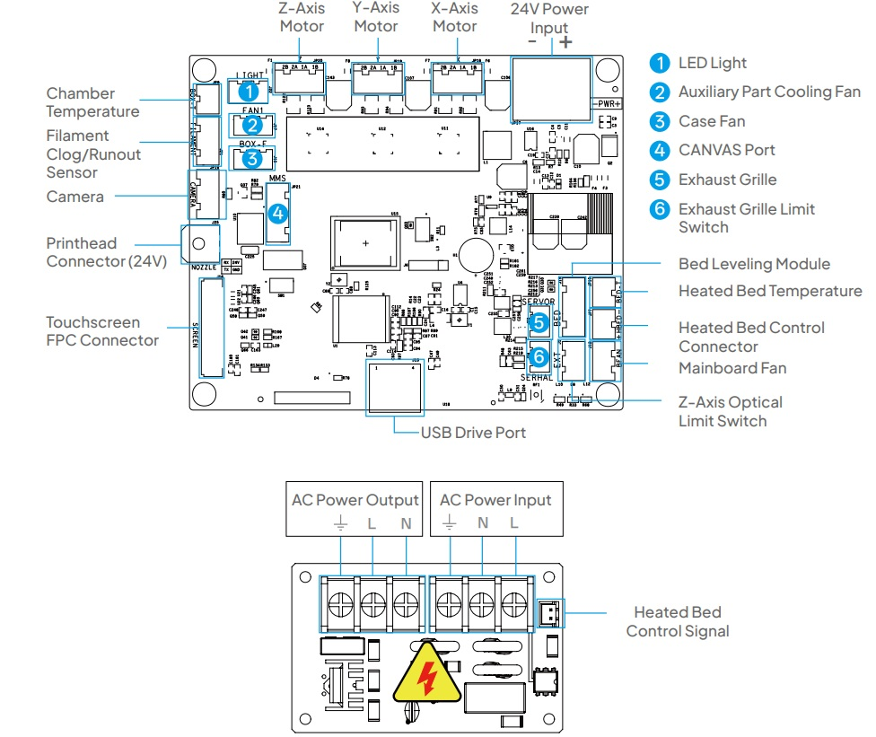

# CC2 Mainboard

Metric|Value
---|---
SoC|AllWinner R528-S3
Memory|128 MB in-chip
Storage|8gb eMMC
Stepper drivers|tmc2209

{ width="800" }
/// caption
Credit to keefe826 on the OpenCentauri Discord.
///
{ width="800" }
/// caption
Credit to Savion on the OpenCentauri Discord.
///

## Mainboard Pins

### 24V input
Type: 2-Pin Barrier terminal with 9.6mm pin pitch

|pin nr|marking|Function|remarks|
|--|---|----|---|
|1| - | GND |Closest to the stepper connectors|
|1| + | +24V |Do not overtighten as it is very flimsy|

### Steppers X,Y and Z
Type: JST-**XHB**-4P 

|pin nr|marking|Function|remarks|
|--|---|----|---|
|1| 2B|2B||
|2| 1A|1A||
|3| 2A|2A||
|4| 1B|1B||

### Chamber temp sensor 
Type: JST-**XHB**-2P

|pin nr|marking|Function|remarks|
|--|---|----|---|
|1| none | Sig |standard NTC100k B3950| 
|2| none | GND ||

### Light
Type: JST-**XHB**-2P

|pin nr|marking|Function|remarks|
|--|---|----|---|
|1| + | +24V | Max 1A | 
|2| - | GND_PWM| |

### Side fan (Marked "FAN-1" on the board)
Type: JST-**XHB**-2P

|pin nr|marking|Function|remarks|
|--|---|----|---|
|1| + | +24V | MAX 1A|
|2| - | GND_PWM ||

### Display
Type: xx Pin FFC

RGB888 display + touch\
``unknown pinout``

### Front  USB
Type: USB-A

|pin nr|marking|Function|remarks|
|--|---|----|---|
|1| GND | GND | regular usb-A port|
|2| DP | DP ||
|3| DM | DM ||
|4| 5v | +5V ||

### Z-endstop (Marked "EXT" on the board)
Type: JST-**XHB**-3P

|pin nr|marking|Function|remarks|
|--|---|----|---|
|1| | +24V||
|2| | GND||
|3| | SIG |3.3V pullup, LOW/0v when bed is not in sensor|

|pin nr|marking|Function|remarks|
|--|---|----|---|
|1|  | +24V ||
|2|  | GND_PWM | Controlled by MCU
|3|  | Tacho ||

### Bed MCU (RS-232)
Type: JST-**XHB**-5P

|pin nr|marking|Function|remarks|
|--|---|----|---|
|1| 24V | +24V | Not used on the leveling mcu board|
|2| GND | GND |
|3| 5V | +5V | 5v is switched to reset the bed MCU |
|4| TX | TX||
|5| RX | RX||

### Bed heater "HBED"
Type: JST-**XHB**-2P

|pin nr|marking|Function|remarks|
|--|---|----|---|
|1| - | GND_PWM | Controlled by MCU|
|2| + | +24V||

### Bed temperature sensor "BED-T"
Type: JST-**XHB**-2P

|pin nr|marking|Function|remarks|
|--|---|----|---|
1|  | SIG|  NTC100k B3950|
2|  | GND|  |
