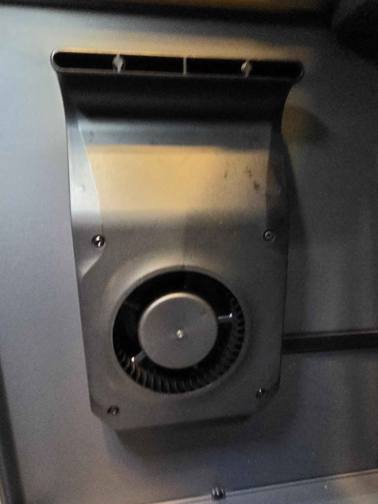

## Aux Fan

Metric|Value
---|---
Auxillary fan type|12032 radial fan, 4 pin (tach+5V PWM)
Auxillary fan P/N|
Auxillary fan power|

The CC2 Aux fan is mounted on the left panel with intake below the from the lower half of the chamber. This enables its use for heat soaking the printer and reduces external noise compared to the external intake aux fan on the CC1.

{ width="800" }
/// caption
Credit to pdscomp on the OpenCentauri Discord.
///

## Exhaust/filtering system
Metric|Value
---|---
Exhaust fan type|12025 axial fan, 4 pin (tach+5V PWM)
Exhaust fan P/N|
Exhaust fan power|

The exhaust/filtering system on the CC2 uses a servo to open or close a shutter system to switch between exhaust and recirculation filtering.

{ width="600" }
/// caption
Credit to keefe826 on the OpenCentauri Discord.
///
{ width="600" }
/// caption
Credit to keefe826 on the OpenCentauri Discord.
///

## Chamber Thermistor
The CC2 presumably uses the same NTC100K thermistor as the CC1, however it has been relocated from the rear right vertical extrusion to near the plastic components the rear leadscrew is secured to.