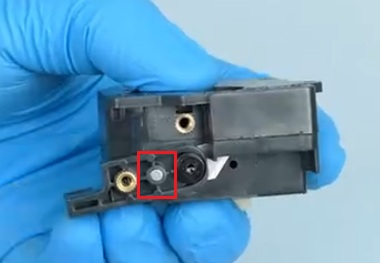

{ width="800" }
/// caption
Credit to keefe826 on the OpenCentauri Discord.
///

The toolhead board is connected over a USB-C cable. Unlike the CC1 serial is used instead of USB protocol for communication. The toolhead board is receives 24v power.

## Supplementary board

{ width="600" }
/// caption
Credit to keefe826 on the OpenCentauri Discord.
///

The Toolhead board has an 2x4 pin port at the bottom of the board. This connector connects to a separate pcb, that breaks out the necessary connectors for the hotend (Temperature sensor, heater, hotend fan).

## Filament Detector Board

The CC2 has an additional filament detector board that connects to the bottom port on the opposite side of the supplementary board pins on the toolhead board. This board uses an optical sensor the detect the if filament has entered the extruder, a spring is soldered to the back side of the board that retains a lever that is actuated to block the optical sensor when filament enters the extruder. A new front and rear extruder shell are used to accommodate the filament detector and filament [multiplexer](../CANVAS/#filament-multiplexer). This board additionally hosts forward and rear facing hall effect sensors. The forward hall effect sensor is on the middle of the board and is used for toolhead cover detection by means of a small magnet that has been added to the CC2 toolhead. The rear hall effect sensor is on the top back side of the board and extends over the metal tube of the multiplexer and is likely used to detect its presence.

{ width="800" }
/// caption
Credit to keefe826 on the OpenCentauri Discord.
///

{ width="600" }
/// caption
Back side of detector board showing filament actuation lever, optical sensor, and multiplexer sensor. Credit to sune2573 on the OpenCentauri Discord.
///

{ width="600" }
/// caption
Filament detector board annotated with hall effect-based cover detection. Credit to keefe826 on the OpenCentauri Discord.
///

## Filament cutter actuation sensor

A small board screwed into the hotend uses a hall effect sensor used to detect filament cutter actuation by a magnet mounted in the filament cutter arm. It is connected to the right side of the filament detector board.

{ width="400" }
/// caption
Fan shroud board. Credit to u/CalligrapherLoud778 on the Elegoo subreddit.
///
{ width="380" }
/// caption
Filament cutter magnet location highlighted in red
///

## MCU

Metric|Value
---|---
MCU|
Vendor Id|
Product Id|
Device BCD|
Product|
Manufacturer|
Stepper driver|tmc2209

## Hardware

Metric|Value
---|---
Motor type|10T NEMA14 (round, 20.5mm long)
Motor P/N|BJY36D12-04V28
Motor MFG|SHENZHEN  KELI MOTOR  LTD
Extruder gear ratio|52:10
Extruder hobbed gear diameter|10mm nominal
Heater type|Ceramic plate-type PTC heater
Heater resistance|~9.6Ω
Heater power|60W
Part cooling fan type|5020 custom radial fan integrated into duct, 4 pin (tach+5V PWM)
Part cooling fan P/N|
Part cooling fan power|0.50A @ 24V
Hotend fan type|3010 axial fan, 3 pin (tach)
Hotend fan P/N|
Hotend fan power|0.10A @ 24V

{ width="800" }
/// caption
Credit to keefe826 on the OpenCentauri Discord.
///

{ width="800" }
/// caption
Credit to sune2573 on the OpenCentauri Discord.
///