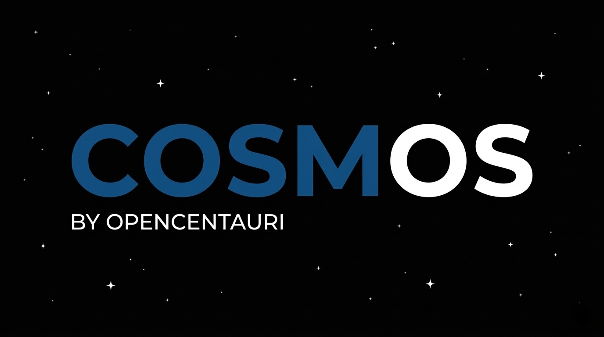
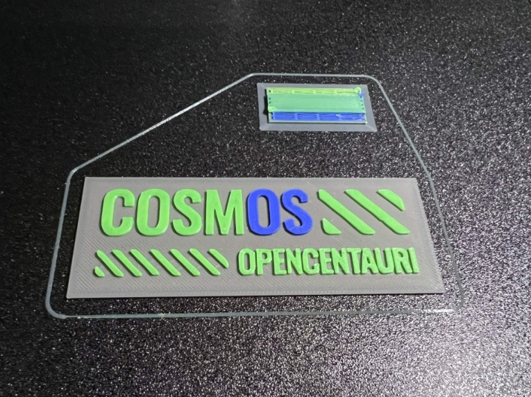

# COSMOS

{ width="900" }
/// caption
Credit to notgut on the OpenCentauri Discord for logo design.
///

Run Klipper on the stock hardware (stock mainboard).

Read the [installation instructions](./install.md)

Read the [custom features](./features.md) offered by COSMOS.

!!! warning "**Looking for regular Opencentauri?**"

    This is a Beta full Klipper/Kalico firmware, for regular OpenCentauri patched from official Elegoo firmware go [here](../../patched-firmware/index.md)

!!! Danger "**Stop: Before you add any plugins**"

    The stock mainboard is extremely resource limited and there is currently very little overhead to run any plugins, packages, or features not in standard klipper/kalico. Do not attempt to install others unless you _really_ know what you are doing!

## FAQ

??? question "**What is COSMOS?**"

    Open source firmware for the Elegoo Centauri Carbon based on Klipper/Kalico that grants full control over the hardware.

??? question "**What does COSMOS get me that the stock firmware or OC doesn't?**"

    - Ability to directly enter gcode commands in webui console and calibrate from the webui
    - Ability to view the bed mesh in the webui
    - Display input shaper data and compare how mods effect achievable acceleration
    - Ability to level the bed at other temperatures which will give much better ABS first layers since you don't need to worry about bed warp if you level at temp
    - Store as many bed meshes as you'd like and automatically the appropriate mesh in start gcode for any combination of build plate and bed temp.
    - Better leveling scripts that increase accuracy
    - See fan RPM in the webUI
    - Directly set exhaust fan speed
    - Ability to add an aftermarket AMS (see this [repository](https://github.com/shawn-makes-stuff/cosmoace-integration) for information on ancubic ACE integration on COSMOS)
    - Full control over I/O pins- this should make it possible repurpose model fan - tachometer pin for a toolhead filament detector
    - Ability control and dim the toolhead led for those that have added it, from webui and printer screen
    - Dimming control on the main light
    - Additionally all the major benefits of OC V3.0 (eliminating excessive outgoing traffic, homing changes to increase cable durability, fixed mid-print fan control)

??? question "**Sounds great but what's the catch?**"

    COSMOS is not currently stable so you should not install the early beta builds on any production machine or printer that you cannot afford to wait for a bugfix if problems arise. However if you are in a position to try the beta build any feedback and bug reports will greatly help the Dev team polish the firmware!

??? question "**Do I need any additional hardware to run COSMOS?**"

    No, COSMOS runs entirely on the stock hardware and no additional boards or equipment is required other than a flash drive 

??? question "**How do I install COSMOS?**"

    Instructions are available on the [here](./install.md)

??? question "**How long does it take to install COSMOS?**"

    The above process takes <5 minutes to prepare if you already have OC installed, however the first boot after install will take longer than usual because new firmware is being flashed to the toolhead and bed boards. This usually takes 5-10 minutes.

??? question "**How do I uninstall COSMOS?**"

    There is a button in the COSMOS main menu that allows you to revert your printer to the stock firmware.

??? question "**Does installing COSMOS break my printers warranty?**"

    While we cannot say with certainty what elegoo's position is we have not heard of any reports of customers being denied warranty services and part replacements after installing 3rd party firmware such as OpenCentauri.

??? question "**What do I do if I find a bug?**"

    [Open an issue on GitHub](https://github.com/OpenCentauri/cosmos/issues) and provide a brief description of what happened and the steps to reproduce it. Alternatively you can also drop by the #COSMOS_development channel on the [Opencentauri Discord server](https://discord.gg/t6Cft3wNJ3) to let us know.

??? question "**Will COSMOS be available for the Centauri Carbon 2?**"

    Maybe, but developer efforts are focused on the CC1 for the time being

??? question "**Is COSMOS related to the OpenCentauri board?**"

    No, the OpenCentauri board is another ongoing project to create a much more powerful drop in mainboard replacement for the Centauri Carbon. 

??? question "**Can I add a raspberrypi to offload work from the stock mainboard?**"

    Not currently. The stock hardware is not very powerful and has limited memory which is why adding a pi or other SBC may interest some, however the primary focus of the project right now is to create stable firmware for the stock board.

??? question "**How can I support COSMOS development?**"

    You can make a one time or monthly donation to [support the OpenCentauri project on our KoFi](https://ko-fi.com/opencentauri)

{ width="500" }
/// caption
Credit to [shawn-makes-stuff](https://github.com/shawn-makes-stuff) for Demo print on CC1 and anycubic ACE multicolor print with COSMOS.
///