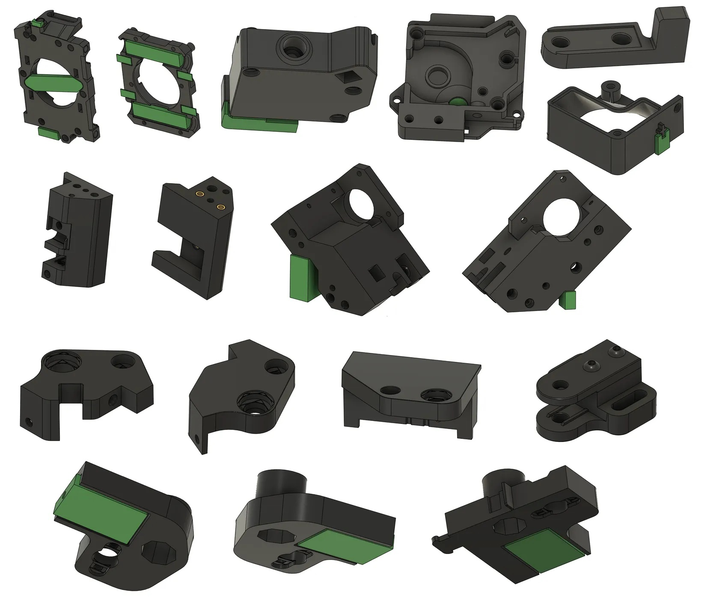
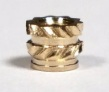

The goal of this project is to provide FDM-friendly replacement part CAD that is as close to stock parts as possible. This will allow CC owners to print replacement parts easily, and also serve as a base for future modifications. Most of these parts are cross-compatible with the CC2. The parts are available in the Opencentauri CAD [github repository](https://github.com/OpenCentauri/cad) in STEP, STL, and 3MF format with the latter two in proper printing orientation.

{ width="600" }

### Parts-Included

Built in support has not been added to all models where it is required. further improvements may need to be done on some of these models- these are not tested designs and if you run into problems or want to contribute changes reach out on the opencentauri discord or make a pull request on the OC CAD github. The following parts are included:

- carriage part
- Extruder parts
- Front idler mounts
- Motor mounts
- bed mounts
- Z belt tensioner
- top rod/leadscrew mounts

Additionally not all models are particularly well suited for direct FDM optimization and better scratch designs from the community are available. In particular this applies to:

- XY Bearing blocks:  [clogged_nozzl3's bearing blocks](https://www.printables.com/model/1535090-centauri-carbon-runice-toothed-idler-blocks) are recommended
- Toolhead cowling/shell: There are numerous toolhead cowling options that are more suitable for FDM printing including the following:
    - [clogged_nozzl3's ACCTC cowling](https://www.printables.com/model/1575497-another-centauri-carbon-toolhead-cover) heavily modified low mass gamma-variant
    - [layer.shifted's cowling](https://www.printables.com/model/1511606-centauri-carbon-lightweight-cowling) which offers a close to stock styling
    - [Robert Samples' gamma cowling](https://www.printables.com/model/1410999-g-gamma-toolhead-cover-for-elegoo-centauri-carbon) which offers a high strength low mass magnetic version
    - [Synthetic Electron 3D's cowling](https://www.printables.com/model/1399340-se3d-elegoo-centauri-carbon-toolhead-cover) the first printable design with numerous remixes

### Printing and use instructions

ABS/ASA minimum recommended. Counterbore bridging was used to eliminate support requirements where possible but in other places built in supports (in green) are part of the printable base models as discrete objects, they are optimized for printing with 0.2 mm layer height. DO NOT ADD EXTRA SUPPORT. orientation for printing should be fairly obvious but refer to 3mf or STL files if you are unsure. The Z tensioner is split into two halves which are printed separately and screwed together. You will need m3x5x4mm heatset inserts for this, as well some m2.5 heatsets ones for the carriage. They must be the following style and not injection molding type inserts.

{ width="200" }

