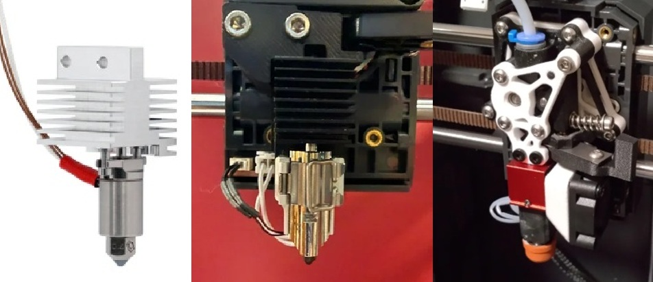
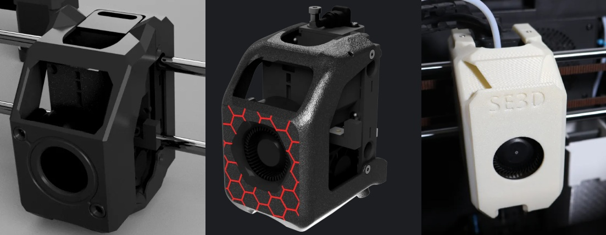

## Risers and Strain Relief

**Cable Arm Riser and Vertical Strain Relief**

Daniel Cherubini's [vertical strain relief](https://www.printables.com/model/1447575-elegoo-centarui-carbon-usb-cable-strain-guide) and Devin's Cable arm risers (eg. [1](https://www.printables.com/model/1450583-centauri-carbon-cable-arm-sturdy-riser), [2](https://www.printables.com/model/1412274-elegoo-centauri-carbon-low-riser-remix-fixed), [3](https://www.printables.com/model/1452465-centauri-carbon-cable-arm-vented-riser) ) are the currently recommended solutions to adress the failure-prone USB cable on the CC1.

{ width="300" }

## Alternate Hotends and Extruders

Several aftermarket or printable extruder and hotend modifications are available for the CC2. These often aim to address the weak and mechanically vulnerable structural heatbreak that often bends during print failures or nozzle strikes.

{ width="800" }
/// caption
Three popular types of alternate hotends/extruders. From left to right Microswiss flowtech, ECCH2A1, and Constellation
///

**Microswiss Flowtech**

A [commercial solution](https://store.micro-swiss.com/products/flowtech-hotend-for-elegoo-centauri-carbon) using flowtech nozzles and similar heatblock to that used on the bamulab X1/P1 flowtech hotend. Allows use of CHT nozzles, but has a shorter melt zone than the stock CC hotend. 

- Pros: Drop in compatibility, nozzle shared across other flowtech hotends, easy nozzle swaps, nonstructural heatbreak 
- Cons: High cost, not compatible with CC2, may not be rated up to 320C.

**H2D/A1 hotend retrofit**

Several options are available in the form of printable models and premade solutions on etsy such as the ECCH2A1. Allows use of H2D/A1 nozzles. 

- Pros: Premade solutions available, rapid nozzle changes, nonstructural heatbreak, low to moderate cost when self-sourced
- Cons: Requires annealing and high performance materials for heat resistance (PPS, PPA, PA6/12, or PET composites). Moderate cost when purchased premade.

**Constellation extruder**

A full extruder housing [replacement](https://www.printables.com/model/1382168-constellation-extruder-for-elegoo-centauri-carbon) that reuses the stock extruder internals and allows native mounting of Bambu X1/P1 compatible hotends such as the TZ clone ecosystem, or the pika hotend. Three versions for different configurations available 

- Pros: Nonstructural heatbreak, low cost, high flow or revo-like cold swap options available, uses standard V6 nozzles, doesn't require annealing. 
- Cons: Many parts must be self sourced, relatively high assembly difficulty.

## Alternate Toolhead covers
{ width="800" }
/// caption
Three popular lineages of toolhead covers. From left to right Γ/gamma, ACCTC, and S3D covers
///

**Γ/gamma**
The [gamma cover](https://www.printables.com/model/1410999-g-gamma-toolhead-cover-for-elegoo-centauri-carbon) is a moderately mass-reduced, high strength magnetic toolhead shell, that fits securely by placing magnets in tapered magnetic pins

**ACCTC**
[Another Centauri Carbon Toolhead Cover/ACCTC](https://www.printables.com/model/1575497-another-centauri-carbon-toolhead-cover) Is loosely derived from gamma as well as many other designs and is a highly mass-reduced toolhead shell, with rigid cover mounting using screws

**SE3D**
The [SE3D cover](https://www.printables.com/model/1399340-se3d-elegoo-centauri-carbon-toolhead-cover) was the first replacement cover for the centauri carbon and is a a moderately mass-reduced toolhead cover featuring dovetail peg and screw mounting, though numerous variants with alternate mountings and mass reductions are available.

