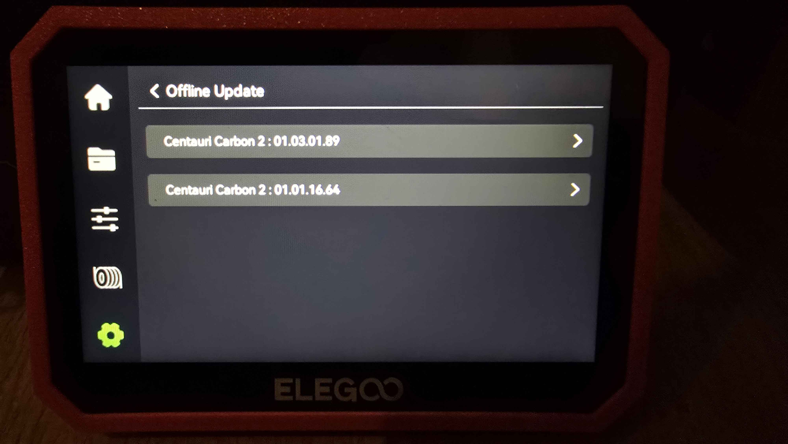
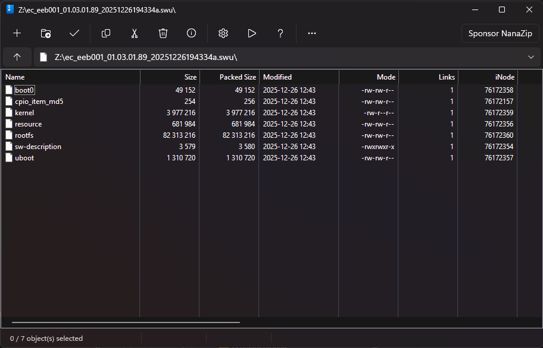

# CC2 update archive

## Updating locally (via USB)

1. Download a firmware from one of the packageUrl's in the [Firmware update archive](#firmware-update-archive) section.
3. Plug in a USB thumb drive and put the just downloaded file on the root of the USB.
4. Plug the USB thumb drive into the Centauri Carbon 2.
5. Navigate to Settings, `Check for Updates`, `Offline Update`, and select the downloaded update.

{ width="400" }
/// caption
Credit to foggingweeb on the OpenCentauri Discord.
///

## Decrypting & Unpacking updates

The Centauri Carbon 2 delivers its updates in a .zip.sig format. Their .sig format seems to be an encryption/metadata wrapper around a file. Inside the zip 2 files can be found:

- `*.swu.sig`: The update package.
- `*.json.sig`: Metadata information (like version) about other files in the .zip 

??? "Online Firmware unpacker"
    <iframe src="/extras/cc2_update_decrypt.html" width="100%" height="500"></iframe>

{ width="400" }
/// caption
Credit to Sims on the OpenCentauri Discord.
///

The Centauri Carbon 2 makes use of an A/B partition scheme. When an update is applied, the update is applied to the inactive slot. After the update is applied, the machine switches A/B around so the next boot uses the previously inactive slot. The Centuari Carbon 2 makes use of `swupdate` for updates.

## Firmware update archive

### v01.03.01.89 (Released 09/01/2026)
[Download Global (abroad)](https://github.com/suchmememanyskill/cc2-firmwares/raw/refs/heads/main/cc2-01.03.01.89-18d82e89afe354a5801102751e838fcb-release-abroad.zip.sig){  referrerpolicy="no-referrer" .md-button .md-button--primary }
[Download China (homeland)](https://github.com/suchmememanyskill/cc2-firmwares/raw/refs/heads/main/cc2-01.03.01.89-18d82e89afe354a5801102751e838fcb-release-homeland.zip.sig){  referrerpolicy="no-referrer" .md-button .md-button--primary }

Changelog:

1. Added ELEGOO Matrix APP binding function (APP requires v1.0.11 or later)
2. Added ElegooSlicer binding function (requires v1.3.0.11 or later)
3. Optimized occasional screen flickering during LAN video streaming
4. Optimized filament breakage handling during multi-color printing
5. Enhanced CANVAS plug/unplug handling during printing
6. Fixed abnormal settings and reset issues in filament selection
7. Fixed occasional WiFi disconnection

### v01.01.16.64 (Released 11/12/2025)
[Download Global (abroad)](https://github.com/suchmememanyskill/cc2-firmwares/raw/refs/heads/main/cc2-01.01.16.64-0e8e05b1a71e193e1cf428db7280c664-release-abroad.zip.sig){  referrerpolicy="no-referrer" .md-button .md-button--primary }
[Download China (homeland)](https://github.com/suchmememanyskill/cc2-firmwares/blob/main/cc2-01.01.16.64-0e8e05b1a71e193e1cf428db7280c664-release-homeland.zip.sig){  referrerpolicy="no-referrer" .md-button .md-button--primary }

Changelog:

1. Optimized the process of material feeding and unloading
2. Optimized the flushing process during material change
3. Adjusted the material exhaustion handling process in multi-color mode
4. Added material breakage alarm function
5. Added screen off after 25 minutes option
6. Fixed the issue with abnormal cavity temperature alarm
7. Fixed the problem of incomplete material display
8. Improved the stability of connection with slicing soft

### v01.01.16.40 (Released 17/11/2025)
[Download Global (abroad)](https://github.com/suchmememanyskill/cc2-firmwares/raw/refs/heads/main/cc2-01.01.16.40-3b88c664cbd7e5a29bcd44868321971d-release-abroad.zip.sig){  referrerpolicy="no-referrer" .md-button .md-button--primary }
[Download China (homeland)](https://github.com/suchmememanyskill/cc2-firmwares/raw/refs/heads/main/cc2-01.01.16.40-3b88c664cbd7e5a29bcd44868321971d-release-homeland.zip.sig){  referrerpolicy="no-referrer" .md-button .md-button--primary }

Changelog:

1. Optimized the retry mechanism for feeding failures under CANVAS
2. Fixed the issue where the tool head consumable detection failed to trigger under certain conditions
3. Resolved the abnormal triggering count issue of filament entanglement detection
4. Fixed the abnormal display issue during Wi-Fi search
5. Adjusted the RFID recognition status to avoid detection during self-check
6. Fixed the file display abnormality issue
7. Added multi-language display support

### v01.01.16.21 (Released 31/10/2025)
[Download Global (abroad)](https://github.com/suchmememanyskill/cc2-firmwares/raw/refs/heads/main/cc2-01.01.16.21-a20c212081d7287869bf094cb1522106-release-abroad.zip.sig){  referrerpolicy="no-referrer" .md-button .md-button--primary }
[Download China (homeland)](https://github.com/suchmememanyskill/cc2-firmwares/raw/refs/heads/main/cc2-01.01.16.21-a20c212081d7287869bf094cb1522106-release-homeland.zip.sig){  referrerpolicy="no-referrer" .md-button .md-button--primary }